# ～軽量監視システムの導入～

## 目次
1. [はじめに](#1-はじめに)
2. [完成条件](#2-完成条件)
3. [前提条件](#3-前提条件)
4. [システム構成](#4-システム構成)
5. [事前準備](#5-事前準備)
6. [構築手順](#6-構築手順)
7. [動作確認と検証](#7-動作確認と検証)
8. [トラブルシューティング](#8-トラブルシューティング)
9. [参考資料](#9-参考資料)

## 1. はじめに
本手順書は、Windows Subsystem for Linux(WSL2)環境に Docker Compose を用いて Prometheus、Node Exporter、Grafana をコンテナ化して展開し、**ホストOS（WSL2環境）のリソース監視ダッシュボード**を構築するための手順書です。

初期状態の WSL2 環境から、この手順を順に実行することで、完全に同じシステムを再構築できることを目指しています。


## 2. 完成条件

以下の全て に該当することを確認できたら完成とします：

1.  **Grafana Web UIへのアクセス**：http://localhost:3000 にアクセスでき、ログインダイアログが表示される
2.  **ダッシュボード表示**：ダッシュボード『Node Exporter for Prometheus』(ID: 1860) が正常に読み込まれる
3.  **メトリクス表示**：CPU使用率が**数値**として表示され、「No data」と表示されていないこと
4.  **全サービスが起動**：`docker ps` で prometheus、node-exporter、grafana のステータスが全て `Up` である

## 3. 前提条件

| 項目 | 内容 |
|------|------|
| **対象OS** | Ubuntu 24.04 LTS (WSL2) |
| **実行環境** | Windows 11 + WSL2 (バージョン 2.6.1.0 以上推奨) |
| **パッケージ管理** | apt、Docker Engine、Docker Compose |
| **ネットワーク** | localhost のみ（外部公開なし） |
| **所要時間** | 約30〜45分 |

## 4. システム構成

[図1: システムアーキテクチャ]

```
┌─────────────────────────────────────────────────────┐
│  Windows 11                                         │
├─────────────────────────────────────────────────────┤
│  WSL2 (Ubuntu 24.04)                                │
│  ┌───────────────────────────────────────────────┐  │
│  │ Docker Network: monitoring (bridge)           │  │
│  │                                               │  │
│  │  ┌──────────────┐  ┌──────────────┐           │  │
│  │  │ node-exporter│  │ prometheus   │           │  │
│  │  │    :9100     │  │   :9090      │           │  │
│  │  └──────────────┘  └──────────────┘           │  │
│  │         ▲                 ▲                   │  │
│  │         └─────────┬───────┘                   │  │
│  │                   │ scrape                    │  │
│  │  ┌────────────────────────────────────┐       │  │
│  │  │ grafana                            │       │  │ 
│  │  │ :3000                              │       │  │ 
│  │  └────────────────────────────────────┘       │  │
│  └───────────────────────────────────────────────┘  │
│         :9090 :3000                                 │
└─────────────────────────────────────────────────────┘
          ▲
          │ localhost
          │
   Web Browser (http://localhost:3000)
```

| ポート | コンテナ名 | 機能 | アクセス範囲 |
|--------|-----------|------|------------|
| 9090 | prometheus | メトリクス確認・管理UI | localhost のみ |
| 3000 | grafana | ダッシュボード表示 | localhost のみ |
| 9100 | node-exporter | メトリクス提供 | Docker network 内のみ |


## 5. 事前準備
### 5-1. WSL2環境の初期セットアップ（所要時間：約10分）

cmdで以下のコマンドを実行することで、Windows上にUbuntu24.04をWSL2としてインストールして使えるようになります。

```bash
# Ubuntu-24.04をインストール
wsl --install Ubuntu-24.04
```

<figure>
  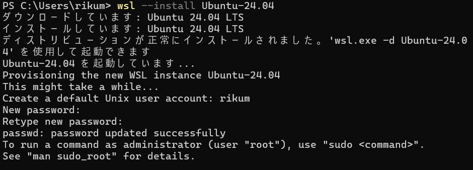
  <figcaption align="center">コマンド実行結果</figcaption>
</figure>

初期ユーザー名はお使いのWindowsのユーザー名が入力されています。パスワードを設定する必要があります。

インストールが完了したら、次のコマンドでバージョンを確認してください。`Ubuntu 24.04.3 LTS`と表示されれば、正しくインストールできています。

```bash
# バージョンを確認
cat /etc/os-release
```

<figure>
  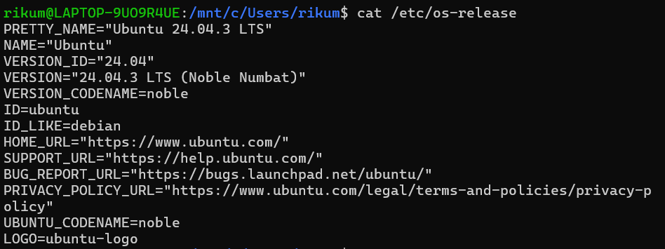
  <figcaption align="center">os-release確認結果</figcaption>
</figure>

次回以降は以下のコマンドでUbuntu-24.04を起動することができます。
```bash
# WSLを起動
wsl.exe -d Ubuntu-24.04
```

インストール直後では、`wsl --install` を実行した場所が開かれています。これはあなたの本物のWindowsのフォルダなので、削除等を行うと普通に消えます。
そのため、間違いが起こらないように新しいユーザを作成し、そこで軽量監視システムの構築を行います。

ユーザ test を作成します。
sudoコマンドを使用するために、先ほど設定したパスワードを入力します。
その後、新規作成するユーザーのパスワードを設定します。
Full Name などの情報は特に入力したいものがなければ、何もせずEnterで大丈夫です。

```bash

# ユーザーを新規作成
sudo adduser test

# 実行結果例
[sudo] password for rikum:  # 先ほど設定したパスワードを入力
info: Adding user `test' ...
info: Selecting UID/GID from range 1000 to 59999 ...
info: Adding new group `test' (1001) ...
info: Adding new user `test' (1001) with group `test (1001)' ...
info: Creating home directory `/home/test' ...
info: Copying files from `/etc/skel' ...
New password:  # 新しく作成するユーザーのパスワードを設定
Retype new password:
passwd: password updated successfully
Changing the user information for test
Enter the new value, or press ENTER for the default
        Full Name []:  # 何もせずEnterでOK
        Room Number []:  # 同上
        Work Phone []:  # 同上
        Home Phone []:  # 同上
        Other []:  # 同上
Is the information correct? [Y/n]  # 同上
info: Adding new user `test' to supplemental / extra groups `users' ...
info: Adding user `test' to group `users' ...
```

<figure>
  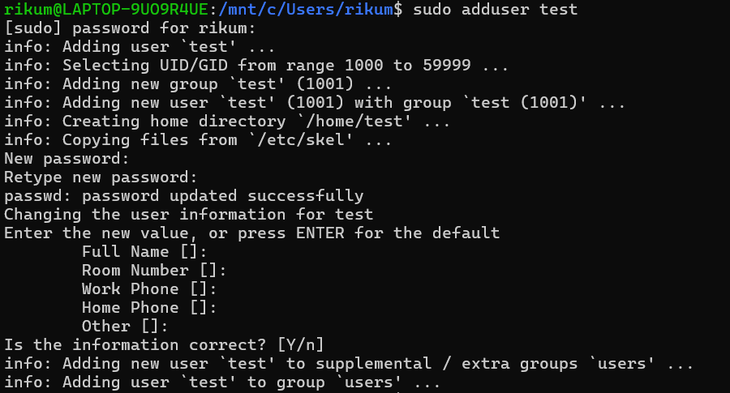
  <figcaption align="center">adduser実行結果</figcaption>
</figure>


続けて、作成したユーザーの test にsudo権限を付与します。

```bash
# testにsudo権限を付与
sudo usermod -aG sudo test
```


次に、testユーザに移動します。
testユーザーを作成するときに設定したパスワードを要求されるので、入力します。
初回はWelcome to Ubuntu ~~~ と出力されます。
``` bash
# testに移動
su - test

# 実行結果
Password:  # testユーザのパスワードを入力
Welcome to Ubuntu 24.04.3 LTS (GNU/Linux 6.6.87.2-microsoft-standard-WSL2 x86_64)

 * Documentation:  https://help.ubuntu.com
 * Management:     https://landscape.canonical.com
 * Support:        https://ubuntu.com/pro

 System information as of Thu Dec 11 00:02:55 JST 2025

  System load:  0.0                 Processes:             33
  Usage of /:   0.1% of 1006.85GB   Users logged in:       1
  Memory usage: 5%                  IPv4 address for eth0: 172.29.151.107
  Swap usage:   0%


This message is shown once a day. To disable it please create the
/home/test1/.hushlogin file.
```

<figure>
  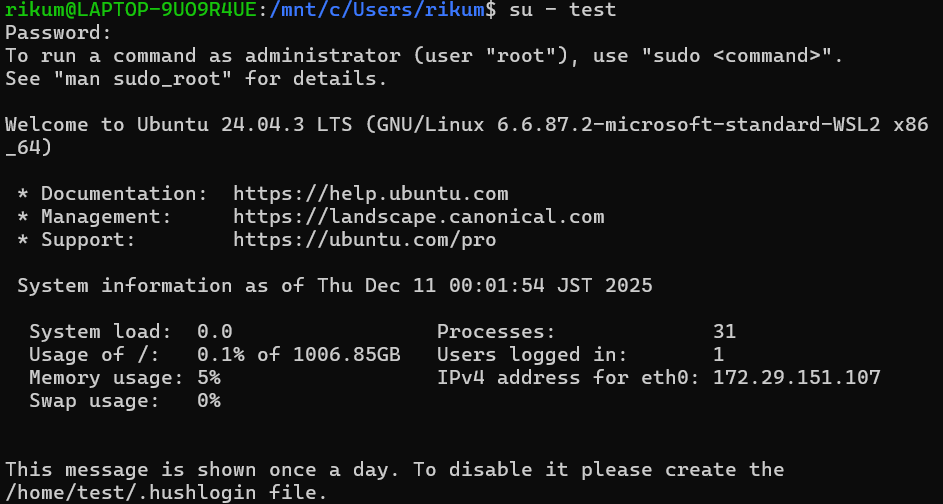
  <figcaption align="center">su - test 実行結果</figcaption>
</figure>

### 5-2. Dockerのインストール（所要時間：約5分）

testユーザーの直下に軽量監視のためのmonitoringフォルダを作成します。

```bash
# monitoringフォルダを作成し、移動
mkdir monitoring
cd monitoring
```

aptをupdateしてから、dockerをインストールします。
```bash
# aptを利用してdockerをインストール
sudo apt update
sudo apt install -y docker.io


# dockerが正しくインストールできているか確認
docker --version
# 実行結果例
Docker version 28.2.2, build 28.2.2-0ubuntu1~24.04.1
```

DockerCompose の latestバージョンを、GitHubから直接インストールします。
```bash
# curlでGitHubから直接インストール
sudo curl -L "https://github.com/docker/compose/releases/download/v2.40.3/docker-compose-$(uname -s)-$(uname -m)" -o /usr/local/bin/docker-compose
```

```bash
# 実行権限を付与
sudo chmod +x /usr/local/bin/docker-compose


# DockerComposeが正しくインストールされているか確認
docker-compose --version
# 実行結果例
Docker Compose version v2.40.3
```

sudoなしでdockerを扱えるようにするために、以下のコマンドを実行します。sudoを実行する際に、パスワードを要求された場合は入力してください。sudoコマンドなしでdockerが動けばOKです。

```bash
# testユーザーをdockerグループに追加
sudo usermod -aG docker test

# 設定を読み込み
newgrp docker

# sudoコマンドなしでdockerを動かす
docker run hello-world
```

<figure>
  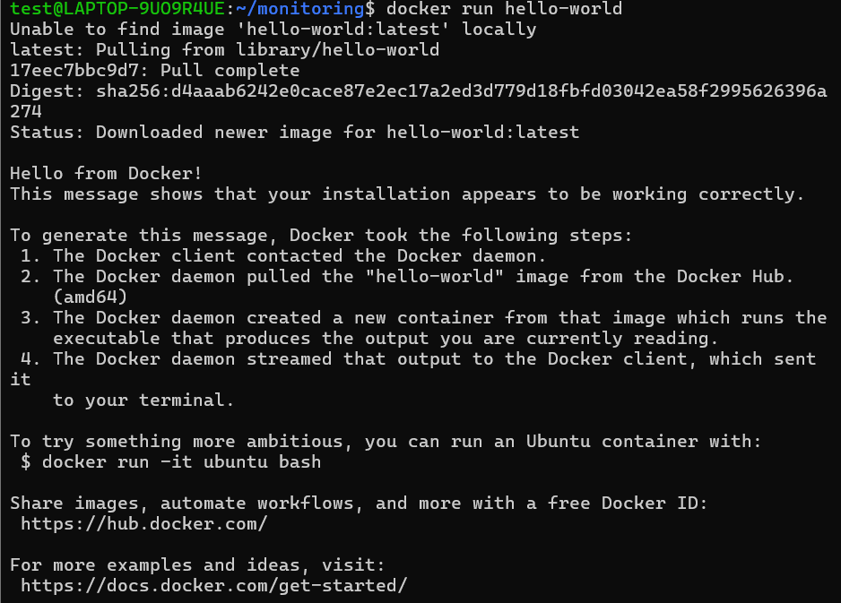
  <figcaption align="center">docker run 実行結果</figcaption>
</figure>

### 5-3. 設定ファイルの準備と所有権設定（所要時間：約5分）

```bash
# ディレクトリ構造を確認
# monitoring/
# ├── docker-compose.yml
# └── prometheus.yml
```

DockerComposeの設定ファイルを作成する。
docker-compose.ymlという名前でファイルを新規作成し、編集する。

```bash
# vimで作成し、編集
vim ~/monitoring/docker-compose.yml
```

以下のコードをコピーして貼り付け

```bash
services:
  prometheus:
    image: prom/prometheus:latest
    container_name: prometheus
    volumes:
      - ./prometheus.yml:/etc/prometheus/prometheus.yml
    ports:
      - "9090:9090"
    networks:
      - monitoring

  node-exporter:
    image: prom/node-exporter:latest
    container_name: node-exporter
    ports:
      - "9100:9100"
    networks:
      - monitoring

  grafana:
    image: grafana/grafana:latest
    container_name: grafana
    ports:
      - "3000:3000"
    networks:
      - monitoring
    volumes:
      - grafana-data:/var/lib/grafana

networks:
  monitoring:

volumes:
  grafana-data:
```

同様にして、premetheusの設定ファイルも作成し、編集する。
```bash
# vimで作成し、編集
vim ~/monitoring/prometheus.yml
```

以下のコードをコピーして貼り付け
```bash
global:
  scrape_interval: 5s

scrape_configs:
  - job_name: 'prometheus'
    static_configs:
      - targets: ['prometheus:9090']

  - job_name: 'node_exporter'
    static_configs:
      - targets: ['node-exporter:9100']
```
設定ファイルの所有権と権限を明記します。
```bash
# ファイルの所有権と権限を確認・設定
ls -la ~/monitoring/
# 出力例：
#-rw-rw-r-- 1 test docker  616 Dec 11 00:45 docker-compose.yml
#-rw-rw-r-- 1 test docker  222 Dec 11 00:56 prometheus.yml
```
### 5-4. サービスの起動（所要時間：約2分）
systemctlコマンドを利用して、dockerを起動します。
statusを確認し、surviceがenable, Activeがactive(running)になっていれば設定はOKです。
```bash
# dockerを起動する
sudo systemctl start docker

# dockerをWSL起動時に自動で起動するように
sudo systemctl enable docker

# dockerの状態を確認
sudo systemctl status docker
```
<figure>
  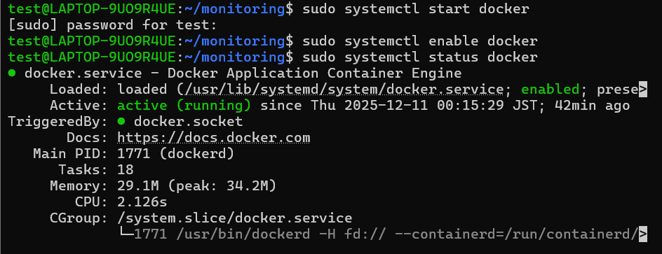
  <figcaption align="center">コマンド実行結果</figcaption>
</figure>

ここで、systemctlが使用できない等のエラーが発生した場合は、次のコマンドでWSLの設定を確認してください。

```bash
# nanoでwslの設定ファイルを確認、ctrl+xの後にEnterで閉じられます
sudo nano /etc/wsl.conf 

# ファイル内容
[boot]
systemd=true  # trueかどうかを確認

[user]
default=test  # testでなくても特に問題はない

# 設定を変更した場合、WSLの再起動を行うこと
wsl --shutdown
```
<figure>
  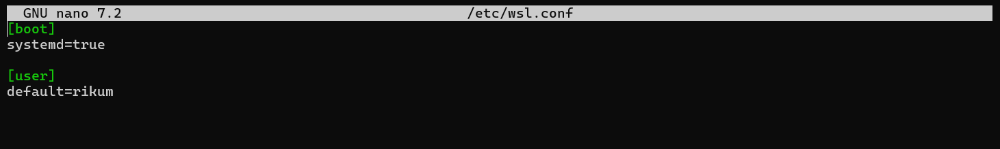
  <figcaption align="center">wsl.confの内容</figcaption>
</figure>

アプリを作成した設定ファイルに従って起動します。

```bash
# docker-compose.ymlを読み込み、サービスを起動
docker-compose up -d
```

<figure>
  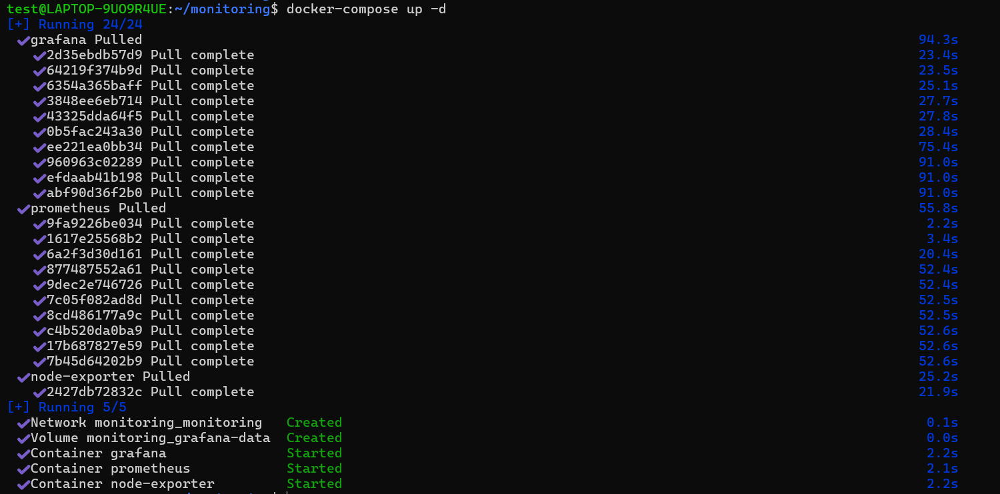
  <figcaption align="center">compose up 実行結果</figcaption>
</figure>


### 5-5. Grafanaの初期設定（所要時間：約5分）

Grafana(http://localhost:3000)にアクセスし、ユーザーネームとパスワードのどちらもadminと入力する。
新しいパスワードの設定を求められるので、入力。
次のような画面に遷移する。

<figure>
  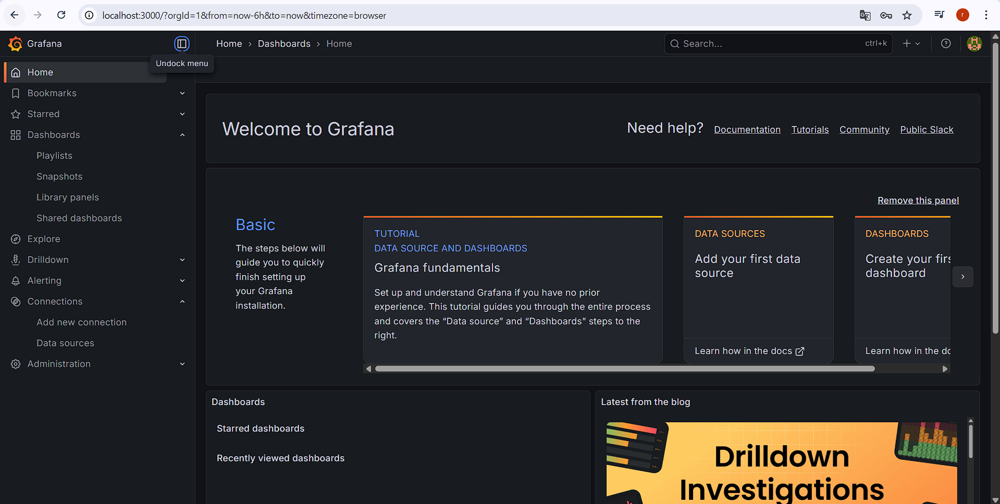
  <figcaption align="center">Grafanaの初期画面</figucaption>
</figure>

左端のメニューバーのConnectionsをクリックし、add new connectionをクリック。
検索欄に、prometheusと入力して、出てきたものをクリック。
右上のadd new data sourceをクリックして、Connectionの入力欄に「http://prometheus:9090」を入力。

<figure>
  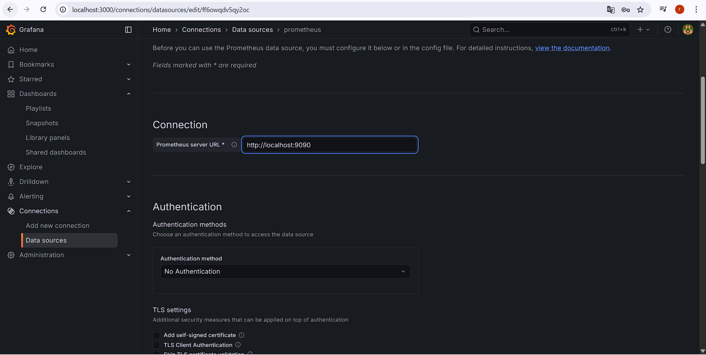
  <figcaption align="center">Connectionにリンクを入力</figcaption>
</figure>

下までスクロールして、 Save & test をクリック。
Successfully queried the Prometheus API. と出力されればOK。


Dashboardsタブを開いて、右上のnewをクリックし、開いたプルダウンからimportをクリック。
Find and import dashboards ~~ の入力欄に1860と入力して、右のLoadをクリック。初期設定のまま、importをクリック。

これで軽量監視の環境の構築は完了です。

## 6. 動作確認と検証

### 6-1. 全サービスの起動確認

Dockerの状態を確認します。
node-exporter, prometheus, grafanaのstatusがUpであることを確認してください。

```bash
# 動いているサービスを確認
docker ps
```
<figure>
  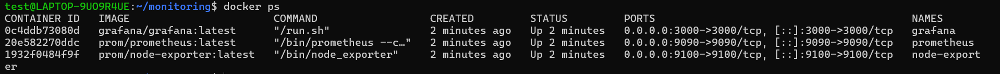
  <figcaption align="center">docker ps の実行結果</figcaption>
</figure>

### 6-2. Prometheus Web UI での確認

```bash
# ブラウザで以下にアクセス
# http://localhost:9090/targets

# 確認項目：
# prometheus     →  State: UP
# node_exporter  →  State: UP
```
<figure>
  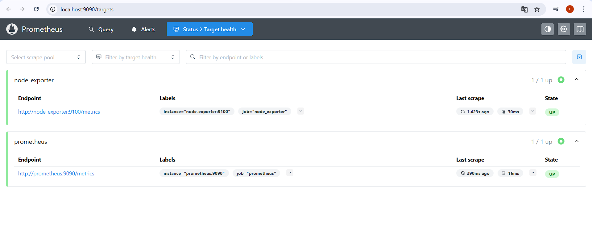
  <figcaption align="center">prometheusの画面
  </figcaption>
</figure>

### 6-3. Grafanaダッシュボード確認
```bash
# ブラウザで以下にアクセス
# http://localhost:3000

# 初期ログイン情報
# Username: admin
# Password: admin（初回ログイン時に変更を促される）

# ダッシュボード確認手順：
# 1. メニュー → Dashboards
# 2. 「Node Exporter full」を開く
# 3. 以下のパネルに数値が表示されていることを確認：
#    - CPU Busy（%）
```

<figure>
  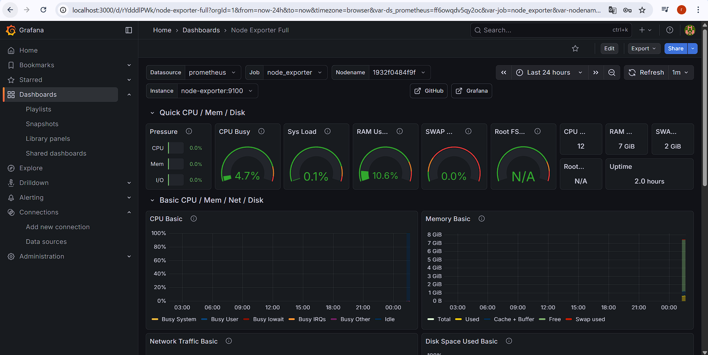
  <figcaption align="center">Grafanaの表示画面例</figcaption>
</figure>

Absolute time rangeの項目をサービスを起動してからの時間に合わせて変更してください。
<figure>
  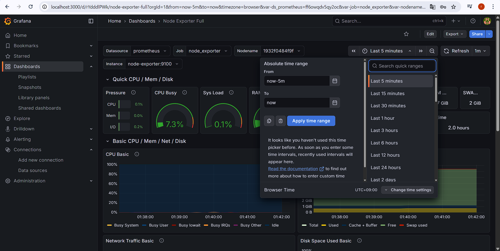
  <figcaption align="center">表示する時間の範囲を変更</figcaption>
</figure>

## 7. トラブルシューティング

### Q1: `docker ps` でコンテナが表示されない、または Status が Exited

**原因**：サービスが起動に失敗しているか、クラッシュしている

**対処**：
```bash
# ログを詳しく確認
docker logs <container_name>

# 例：Prometheus ログを確認
docker logs prometheus

# 典型的なエラー：
# Error: /etc/prometheus/prometheus.yml: no such file or directory
# → prometheus.yml が正しい場所にあるか確認
```

### Q2: Prometheus Web UI でノードのステータスが DOWN

**原因**：ノードエクスポーターが起動していない

**対処**：
```bash
# node-exporter のログを確認
docker logs node-exporter
```

### Q3: Grafana ダッシュボードで「No data」と表示される

**原因**：データソースの設定が不正、またはメトリクス収集がまだ始まっていない

**対処**：
```bash
# 1. サービス起動からの経過時間を確認
#    （Prometheus は約5秒間隔でメトリクスを収集するため、最低5秒待機）

# 2. Grafana → Connections → Data sources にprometheusが設定されているか確認

# 3. ダッシュボード上部の時間範囲を確認
#    「Last hour」など、適切な範囲が選択されているか
```

## 8. セキュリティ考慮

### 8-1. Grafana デフォルトパスワードの変更

初回ログイン時に必ずパスワードを変更してください。


## 9. 参考資料

- **Prometheus 公式ドキュメント**：https://prometheus.io/docs/introduction/overview/
- **Grafana 公式ドキュメント**：https://grafana.com/docs/grafana/latest/
- **Docker Compose 公式ドキュメント**：https://docs.docker.com/compose/
- **Node Exporter GitHub**：https://github.com/prometheus/node_exporter
- **WSL2 公式ドキュメント**：https://learn.microsoft.com/ja-jp/windows/wsl/